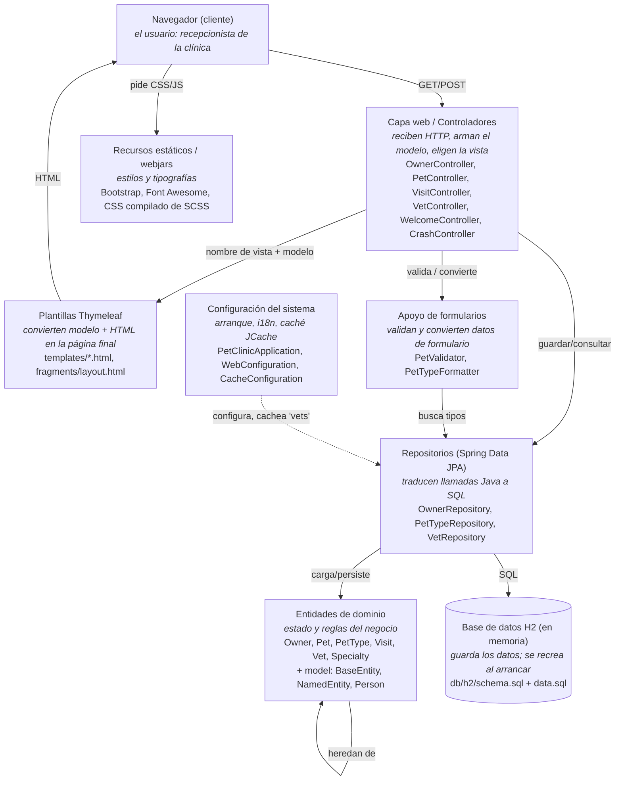

# Mapa de componentes — Spring PetClinic

Versión analizada: `4.0.0-SNAPSHOT` (parent `spring-boot-starter-parent 4.1.0`), clonada el 2026-09-09.
Código de producción: `src/main/java/org/springframework/samples/petclinic` — **1878 líneas** de Java, 22 clases en 4 paquetes + la raíz.

---

## Paso 7 — Inventario: qué hay y quién hace qué

Leído por clase: nombre, `import`s y firmas públicas (sin entrar a los cuerpos).

| Paquete | Clases | Responsabilidad | Depende de (paquetes del proyecto) |
|---|---|---|---|
| `model` | `BaseEntity`, `NamedEntity`, `Person` (+ `package-info`) | Definir las superclases de entidad que las demás heredan: `BaseEntity` aporta el `id` autogenerado y `isNew()`; `NamedEntity` añade `name`; `Person` añade `firstName`/`lastName`. | — (solo JPA y Bean Validation) |
| `owner` | 11 clases: `Owner`, `Pet`, `PetType`, `Visit`, `OwnerController`, `PetController`, `VisitController`, `OwnerRepository`, `PetTypeRepository`, `PetValidator`, `PetTypeFormatter` | Atender todo el dominio dueño–mascota–visita: recibir las peticiones web, validar y convertir los formularios, y leer/guardar en la base de datos. Es el corazón funcional del sistema. | `model` |
| `vet` | 5 clases: `Vet`, `Specialty`, `Vets`, `VetRepository`, `VetController` | Mostrar el listado paginado de veterinarios y sus especialidades, en HTML (`/vets.html`) y en JSON/XML (`/vets`). Solo lectura. | `model` |
| `system` | 4 clases: `WelcomeController`, `WebConfiguration`, `CacheConfiguration`, `CrashController` | Configurar lo transversal: página de bienvenida (`/`), internacionalización (`?lang=`), caché JCache del listado de vets, y un endpoint (`/oups`) que lanza una excepción a propósito para probar la página de error. | — (nada del proyecto) |
| (raíz) | `PetClinicApplication`, `PetClinicRuntimeHints` | Arrancar Spring Boot (`main` → `SpringApplication.run`) y registrar los *runtime hints* de recursos y reflexión para la compilación a imagen nativa (GraalVM). | `model`, `vet` (solo `PetClinicRuntimeHints`, para registrar `BaseEntity`, `Person`, `Vet`) |

**Cómo se llenó "Depende de":** mirando los `import org.springframework.samples.petclinic.*` de cada clase.
- Todo `owner` importa solo de `model` (`Person`, `NamedEntity`, `BaseEntity`).
- Todo `vet` importa solo de `model`.
- `system` no importa nada del proyecto.
- En la raíz, `PetClinicApplication` no importa nada del proyecto; `PetClinicRuntimeHints` importa de `model` y `vet`.
- Ningún paquete importa de `owner`. `owner` y `vet` no se conocen entre sí.

### Roles dentro de `owner` (las 11 clases agrupadas)

| Rol | Qué hace | Clases |
|---|---|---|
| **Controladores web** | Reciben las peticiones HTTP (`@Controller`, `@GetMapping`/`@PostMapping`), arman el modelo y eligen la vista. No tienen lógica de datos: delegan en los repositorios. | `OwnerController`, `PetController`, `VisitController` |
| **Repositorios (acceso a datos)** | Interfaces Spring Data JPA. No tienen implementación escrita a mano: Spring genera el SQL a partir del nombre del método (`findByLastNameStartingWith`) o de `@Query`. | `OwnerRepository`, `PetTypeRepository` |
| **Entidades / objetos de negocio** | Clases `@Entity` mapeadas a tablas; guardan estado y reglas propias (p. ej. `Owner.addPet`, `Owner.addVisit`, `Pet.addVisit`). | `Owner`, `Pet`, `PetType`, `Visit` |
| **Apoyo de formularios web** | Validan y convierten datos que llegan de los formularios: `PetValidator` comprueba nombre/tipo/fecha de una mascota; `PetTypeFormatter` traduce el texto de un `<select>` a un `PetType` y viceversa. | `PetValidator`, `PetTypeFormatter` |

Detalle que se nota al leer las firmas: **no hay `PetRepository` ni `VisitRepository`**. Las mascotas y las visitas se guardan **a través de `OwnerRepository`** (`owners.save(owner)` arrastra en cascada sus `pets` y `visits`, por `cascade = CascadeType.ALL`). El único repositorio "hijo" es `PetTypeRepository`, para poblar el desplegable de tipos.

### Pregunta: ¿por qué `model` no depende de nadie y `owner` depende de `model`, y no al revés?

Porque `model` contiene los conceptos **más genéricos y estables** (tener un `id`, tener un `name`, ser una `Person`). Esos conceptos no necesitan saber qué es un `Owner` o una `Visit`. `owner`, en cambio, sí necesita esas piezas base para construir `Owner extends Person` o `Pet extends NamedEntity`.

Si la dependencia fuera al revés (`model` importando `owner`), aparecería un **ciclo**: no podrías entender ni compilar `model` sin `owner`, ni `owner` sin `model`, y cualquier cambio en una entidad concreta obligaría a recompilar las clases base de todo el sistema. La regla que se cumple aquí: **las dependencias apuntan de lo concreto y cambiante hacia lo general y estable.**

---

## Paso 8 — Flujo: ficha de un dueño (`GET /owners/1`)

Seguido con "ir a la definición" en el IDE, desde el navegador hasta la tabla SQL y la plantilla. Sin números de línea (cambian entre versiones).

1. **Navegador** → `GET http://localhost:8080/owners/1`.
2. `OwnerController#showOwner(int ownerId)` — método anotado `@GetMapping("/owners/{ownerId}")`. Crea `new ModelAndView("owners/ownerDetails")`.
3. Ese método llama `this.owners.findById(ownerId)` → **`OwnerRepository#findById(Integer)`**, interfaz que extiende `JpaRepository<Owner, Integer>` (no hay clase de implementación: la genera Spring Data).
4. Spring Data / **Hibernate** traduce la llamada a `SELECT * FROM owners WHERE id = ?`, y por las relaciones `@OneToMany(fetch = EAGER)` de `Owner.pets` y `Pet.visits` y el `@ManyToOne` `Pet.type`, también consulta `pets`, `visits` y `types`. Las tablas están definidas en **`src/main/resources/db/h2/schema.sql`** y pobladas por `data.sql`.
5. Las filas se mapean a un objeto **`Owner`** (`@Entity @Table(name = "owners")`, que hereda `Person` → `BaseEntity`), con su lista de `Pet` y, dentro de cada uno, su conjunto de `Visit`.
6. De vuelta en `OwnerController#showOwner`: `mav.addObject(owner)` mete la entidad en el modelo y el método devuelve el nombre de vista `"owners/ownerDetails"`.
7. **Thymeleaf** renderiza **`src/main/resources/templates/owners/ownerDetails.html`** (que se compone con `templates/fragments/layout.html`), sustituye `*{firstName + ' ' + lastName}`, la tabla de `owner.pets` y las `pet.visits`, y devuelve el **HTML** final al navegador.

Componentes que aparecen por nombre en el camino: un **controlador** (`OwnerController`), un **repositorio** (`OwnerRepository`), una **entidad** (`Owner`), una **tabla** (`owners` en `schema.sql`) y una **plantilla** (`ownerDetails.html`). El recorrido pasa por la base de datos en el paso 4.

---

## Paso 9 — Mapa de componentes

Componente = grupo de clases con una responsabilidad, no una clase suelta. Flechas en la dirección de uso (quien llama → quien es llamado).

(También en `mapa-componentes.png`.)

### Preguntas de cierre

**1. Si mañana piden registrar vacunas por mascota, ¿qué cajas tocarías y cuáles no?**

Tocaría:
- **Entidades de dominio**: o se amplía `Visit` con un campo/tipo, o se crea una entidad nueva `Vaccination` ligada a `Pet` (como hoy `Visit` cuelga de `Pet` con `@OneToMany`).
- **Base de datos H2**: nueva tabla `vaccinations` (o columnas nuevas en `visits`) en `db/h2/schema.sql` y `db/mysql/schema.sql`, más datos de ejemplo en `data.sql`.
- **Repositorios**: si es entidad nueva y se necesita consultarla aparte, un `VaccinationRepository`; si va colgada del `Owner` en cascada como las visitas, ni eso.
- **Capa web**: un `VaccinationController` o ampliar `VisitController` con la ruta nueva.
- **Plantillas Thymeleaf**: formulario para registrar la vacuna y una fila más en `owners/ownerDetails.html`.
- **Apoyo de formularios**: un validador si hay reglas (fecha, dosis).

No tocaría: el paquete **`vet`**, la **Configuración del sistema**, los **Recursos estáticos**, ni las clases base de **`model`** (`BaseEntity`/`Person` siguen sirviendo igual).

**2. ¿Qué es estructural y qué es acabado? Un ejemplo de cada uno.**

- **Estructural** (cambiarlo arrastra a muchas otras clases): el tipo del `id` en `model/BaseEntity` (`private Integer id`). Cambiarlo a `Long` obliga a tocar los 3 repositorios (`JpaRepository<Owner, Integer>` → `Long`), las firmas `@PathVariable int ownerId` de todos los controladores, `schema.sql` y varias pruebas. Otro ejemplo estructural: que `OwnerRepository` sea el único punto de guardado de `Pet` y `Visit` (vía cascada) — meter un `PetRepository` propio cambiaría cómo persisten tres controladores.
- **Acabado** (se cambia sin que nadie más se entere): el `pageSize = 5` de la paginación, escrito a mano dentro de `OwnerController.findPaginatedForOwnersLastName` y de `VetController.findPaginated`. O el `setTimeout(..., 3000)` en el `<script>` de `ownerDetails.html` que oculta el mensaje de éxito a los 3 segundos. O los textos en `messages/messages*.properties`. Cambiar cualquiera de estos no obliga a tocar ninguna otra clase.
